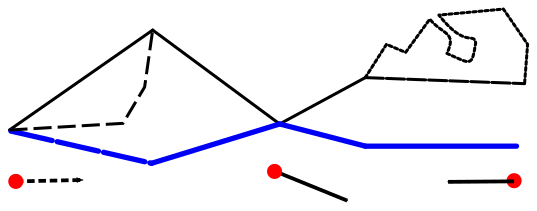
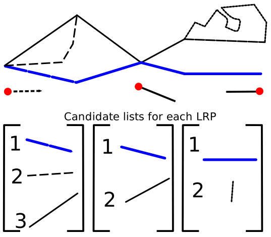
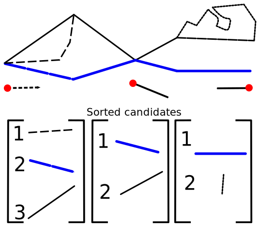

# Introduction
OpenLR™ is a method for map-agnostic location referencing. It enables systems to communicate location information, even when they use dissimilar maps.

# Executive summary
This document provides suggestions for strategies that can be followed when implementing a OpenLR™ line location decoder. Line locations are a subset of OpenLR. They reference a path through the road graph (a set of roads and junctions).

# Scope
This document gives a simplified overview of the process of decoding, and how to choose which roads are part of the location. Multiple roads can be chosen at various points when decoding a location reference. This document helps with selecting the appropriate roads for a line reference, which is called map-matching.
The content provided in this document is provided free of charge, and has no warranty expressed or implied. You can use these tips at your own risk.

# Intended audience
The audience for this document is any developer who is interested in how map-matching works and who wants to implement these techniques.

# What is map-matching in OpenLR?
When we obtain a line location, it consists of a line location path (a path through the road network) and optional offsets on both ends. 
The line location path is referenced by location reference points (LRPs). Each pair of successive LRPs reference a part of the line location path. The goal is to obtain the most appropriate route between each consecutive LRPs, and then putting the parts together.

## First step: list candidates
The first step is obtaining roads within a certain radius near each LRP. This is implementation specific; you should use the method based on the map you are using. Since the target map might be missing certain junctions, we have to also consider points between junctions as candidates. The candidates are then the points on the nearest roads that are closest to the LRP coordinates.

## Second step: score candidates
The second step is scoring (rating) the various candidates (which are points on line segments) to determine how well they meet the LRP information. The LRP information referring to the line location part is:

* The position of the source map junction (The candidate's position should be close to that),
* The physical appearance of the road (defined as the "form of way"),
* The functional road class (the logical type of road based on importance, for example a motorway or a secondary road),
* The direction of the first few meters of road (in relation to due north).

## Third step: route
For every LRP, you should now have candidate points on roads coupled with their scores. For each pair of successive LRPs, we take their best-rated candidates. The shortest path between the two roads is computed. While this is happening, roads that are lower than the FRC threshold are ignored. This FRC threshold comes from the lowest FRC next point attribute (LFRCNP).

## Fourth step: track back or go further
For the shortest path calculated in the third step, we verify that the length of the path matches the designated DNP (distance next point) value. DNP is an attribute of the left side LRP.

If our route is inappropriate, repeat step 3 with the next-best scoring candidate pair.

If our road matches the DNP, go on to the next LRP pair.

## Fifth step: finalize
If we reach the end of the LRP sequence, we can assemble the line location path. This means, all shortest paths between the best LRP candidates that matched the DNP are concatenated. We remove the positive offset from the beginning of this path and from the end of the path we remove the negative offset. We now have the line location.

# OpenLR Python dereferencer
TomTom provides an implementation for readability of the decoding process in the following repository: https://github.com/tomtom-international/openlr-dereferencer-python/

In the previous section, we described the map-matching process and broke it down into its fundamental steps. Now we show examples of how those steps can be implemented.

## Example line location decoding with explanations


Here is an example road network that shows line segments along with their FRC and the FOW, according the legend (previously shown).


Imagine that the encoder references the following line location path (the blue line):



The red dots in the previous figure represent LRPs. The arrows in the figure represent attributes of the next line starting from the LRP. The direction is computed by a certain distance into the path. The last arrow points in the direction of the origin (rather than the destination).

### Finding candidates

We now list lines around each LRP. 



In the previous figure we found candidate lines for each of the LRPs. For simplicity, we won't consider partial lines here.

As we stated in the first step, finding candidate lines is achieved by obtaining roads within a certain radius near each LRP. We ask our map reader to get all roads within a certain radius around the LRP coordinates. On the returned roads, we consider the points closest to the LRP as candidates. As a sub-step we compute the score of each candidate. The last sub-step is returning each road along with its score. 
The following code snippet shows our implementation of this step:

```py
    for line in reader.find_lines_close_to(coords(lrp), config.search_radius):
        yield from make_candidates(lrp, line, config, is_last_lrp)
    ...
```
It calls the `find_lines_close_to` method of our map implementation to get map objects within a certain radius.

Then, a function is called to return all possible candidates for this line. In the Python implementation, this is the point on the road that is closest to the LRP.

### Scoring candidates
The second step is scoring each candidate so they can be properly sorted later, and consider which candidate is the best. The third step takes the scored candidates and sorts them by the best score. This score is chosen by determining which line has the best matching attributes. Considerations include direction, starting point, FRC (functional road class), and the FOW (form of way). 
```py
score = score_lrp_candidate(lrp, candidate, radius, is_last_lrp)
```
The decoder should include some configuration that determines the weighting of each attribute.

Let's assume that our configuration weights the FOW higher than the geo location, because we don't trust the map similarity. In this case, the best-scored candidate for the first LRP is not the proper one. This will be corrected by backtracking.



### Routing between the candidates
For each consecutive LRP the decoder searches for a route between the best candidate points, like described above. In certain circumstances, the route may not be found or may not have the right length. In this case, we try to use the next best candidates.


If we have exhausted the entire list for that specific LRP, we must go back to find the next best candidate for the origin. This backtracking may or may not include the entire path we've determined to this point.

In the Python decoder, the implementation of the backtracking feature is done recursively. For a given LRP with its candidates, there is a certain function called `match_tail `that resolves the rest of the path. The signature is as follows:
```py
def match_tail(current: LRP, candidates, tail: List[LRP], reader: MapReader, radius) -> List[Line]:
``` 

The tail in this context is the remaining list of LRPs. The `match_tail` function generates candidates for the first LRP and routes the candidates of the previous LRP to the new candidates, as described previously. After that, the function calls itself for the remaining LRPs, if there are any. The empty list is a recursion anchor.
### Finalizing the line location
We should now assemble the line location path. We must cut off the positive offset from the beginning of that path, and similarly, we must cut off the negative offset from the end of the path. We have now dereferenced the line location. This means we can link the line location reference to objects on the map. 
## Locations also based on the line location path
### Point along line location
The "point along a line location" is a point on the road network. It is referenced by two consecutive LRPs and a positive offset. The LRP pair expresses a line location path, while the positive offset expresses the location of the point in the path. Decoding is a two step process. In step one, we decode the line location path, as shown in the previous figures. In step two, we traverse the path proportionally based on the positive offset. The resulting point is our "point along line location".
```py
def decode_pointalongline(
    reference: PointAlongLineLocation, reader: MapReader, radius: float
) -> PointAlongLine:
    "Decodes a point along line location reference"
    path = dereference_path(reference.points, reader, radius)
    absolute_offset = path_length(path) * reference.poffs
    line_object, line_offset = point_along_linelocation(path, absolute_offset)
    return PointAlongLine(line_object, line_offset, reference.sideOfRoad, reference.orientation)
```
### POI with access point
The "point of interest with access point" is a point location that is not bound to the road network, but has an access point on some road. The access point is decoded exactly like the point along line location while the actual point is just passed through.
```py
def decode_poi_with_accesspoint(
    reference: PoiWithAccessPointLocation, reader: MapReader, radius: float
) -> PoiWithAccessPoint:
    path = dereference_path(reference.points, reader, radius)
    absolute_offset = path_length(path) * reference.poffs
    line, line_offset = point_along_linelocation(path, absolute_offset)
    return PoiWithAccessPoint(
        line,
        line_offset,
        reference.sideOfRoad,
        reference.orientation,
        Coordinates(reference.lon, reference.lat),
    )
```
## Conclusion
OpenLR offers users a map-agnostic way to communicate line locations. Developers who would like to learn more about OpenLR can consult the [OpenLR whitepaper](https://www.openlr-association.com/fileadmin/user_upload/openlr-whitepaper_v1.5.pdf). 